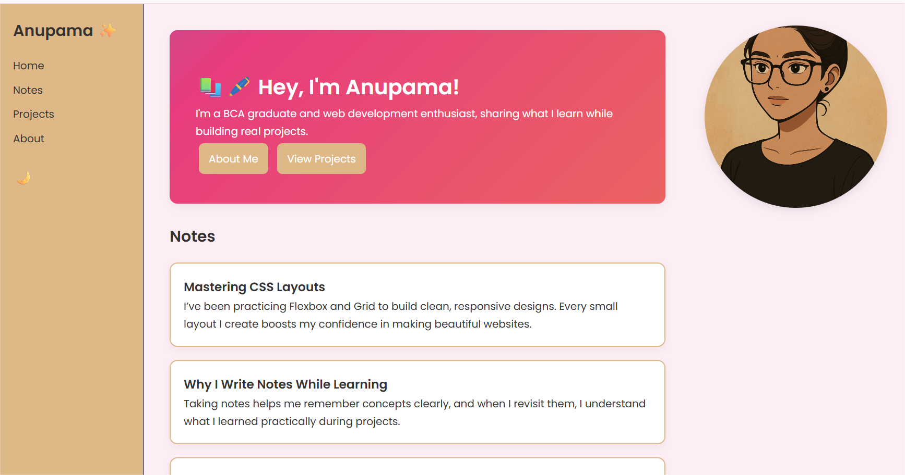
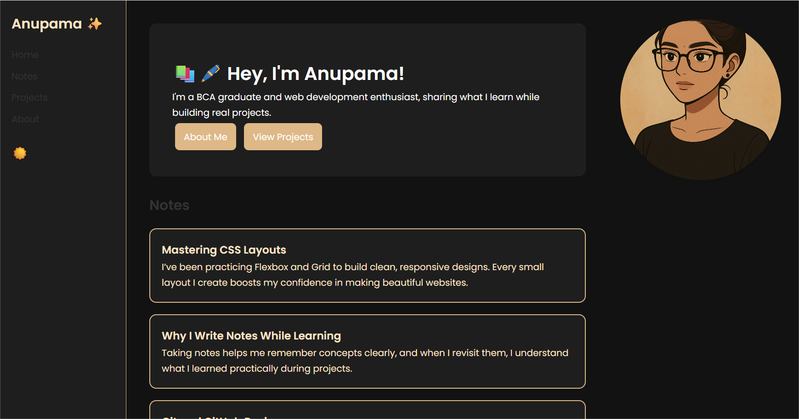
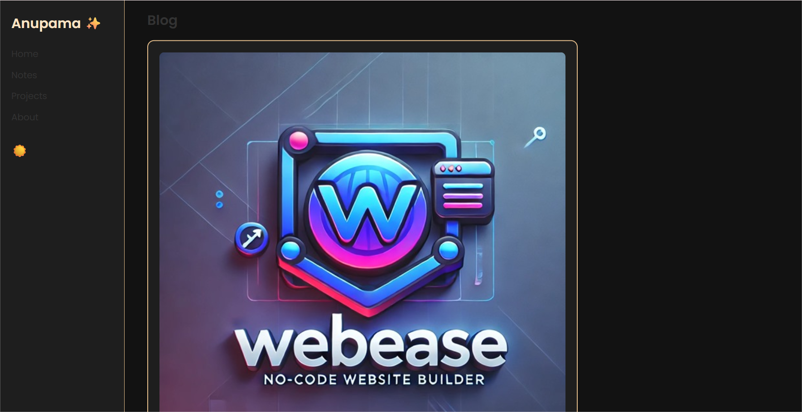

# Anu's Personal Blog Website

🚀 **Live Demo:** [View Anu’s Blog on Netlify](https://clinquant-faloodeh-a3b567.netlify.app)

---

## 📌 Project Overview

I built and deployed a **personal blog website** as part of my **Unified Mentor Internship Project** using:

- **HTML, CSS, JavaScript** for front-end development
- **Netlify** for live deployment and testing across devices

This project helped me understand the structure of a functional, responsive blog website, interactive elements, and deployment workflow.

---

## ✨ Features

✅ Responsive, clean design  
✅ Sidebar navigation for sections  
✅ Notes section with dynamically loaded content  
✅ Blog section with **3 posts** (images, titles, dates, content)  
✅ Like, comment, and share functionality with real-time counts (in-memory)  
✅ Dark mode toggle with smooth animation  
✅ Hero image hover “Hi there” popup effect  
✅ Deployed live using **Netlify**

---

## 🖼️ Screenshots

### Homepage

### Dark Mode Enabled

### Blog Section with Interactions

---

## 🛠️ Tech Stack

- **HTML5**
- **CSS3**
- **JavaScript (Vanilla)**
- **Font Awesome for icons**
- **Netlify for deployment**

---

## 🚀 Learnings

- Designing clean, responsive layouts with HTML and CSS
- Using JavaScript for DOM manipulation and interactivity
- Implementing like, comment, share features in the front-end
- Testing across devices and browsers for compatibility
- Deploying live projects using Netlify

---

## 🌻 Future Enhancements

- Firebase or Supabase integration for real-time data persistence
- User authentication for login-based interactions
- Adding categories and search functionality

---

## 📫 Connect with me

- [LinkedIn](https://www.linkedin.com/)
- [GitHub](https://github.com/)

---

✨ **Thank you for reviewing my Unified Mentor internship project!**
